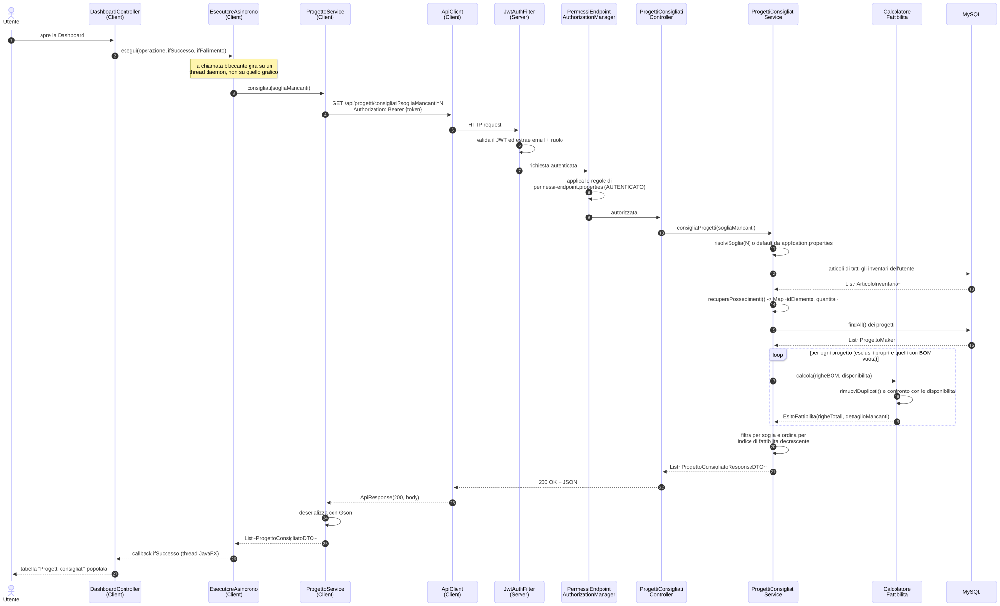

# Diagrammi di supporto per MakerManager

> [!note]
> Versione alternativa di [**`diagrammi.md`**](./diagrammi.md) con diagrammi inglobati come immagini. Non assicuro la leggibilità del file. Se anche questo file non è leggibile o i diagrammi non si possono approfondire, c'è anche la possibilità di consultare le versioni pdf in [**`docs/diagrams/pdf`**](./pdf/)

- [Diagrammi di supporto per MakerManager](#diagrammi-di-supporto-per-makermanager)
  - [Architettura del Client](#architettura-del-client)
  - [Architettura del Server](#architettura-del-server)
  - [Dominio del Server](#dominio-del-server)
  - [Diagramma di sequenza: Progetti Consigliati](#diagramma-di-sequenza-progetti-consigliati)

## Architettura del Client

## Architettura del Server

## Dominio del Server

## Diagramma di sequenza: Progetti Consigliati

