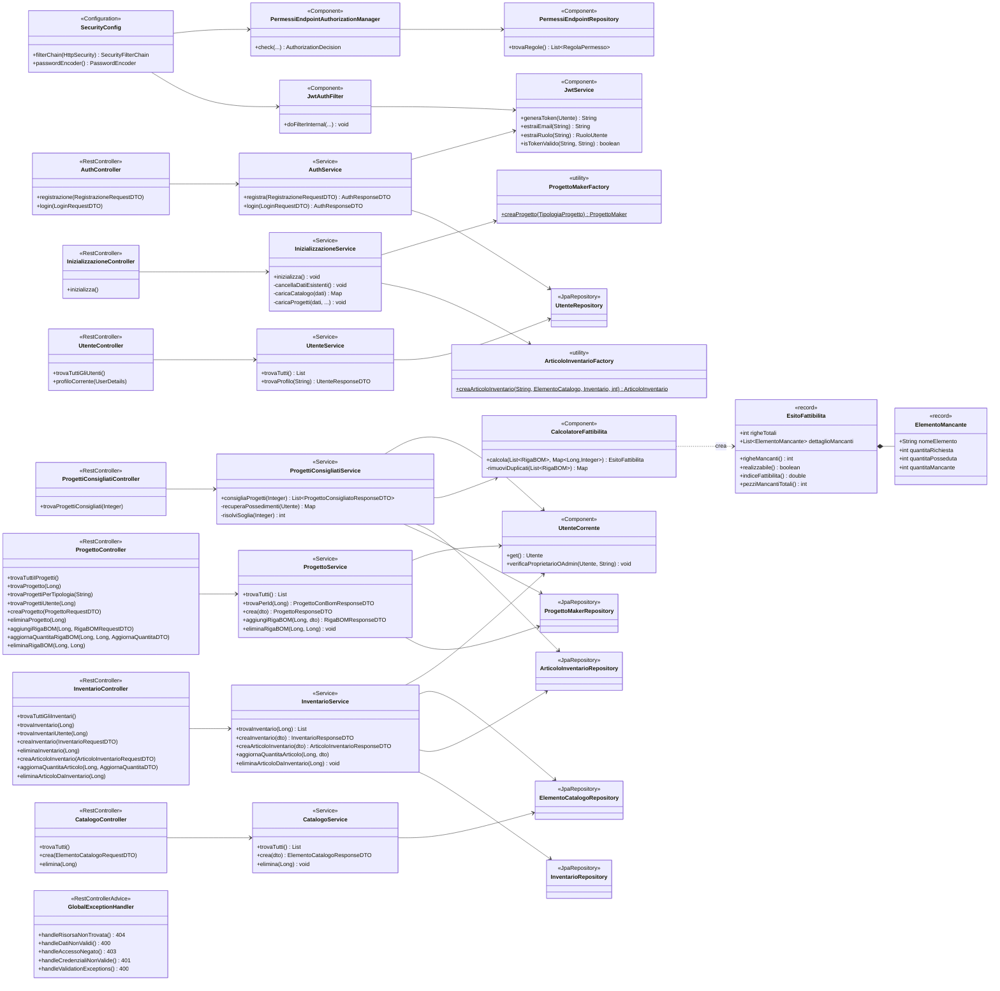
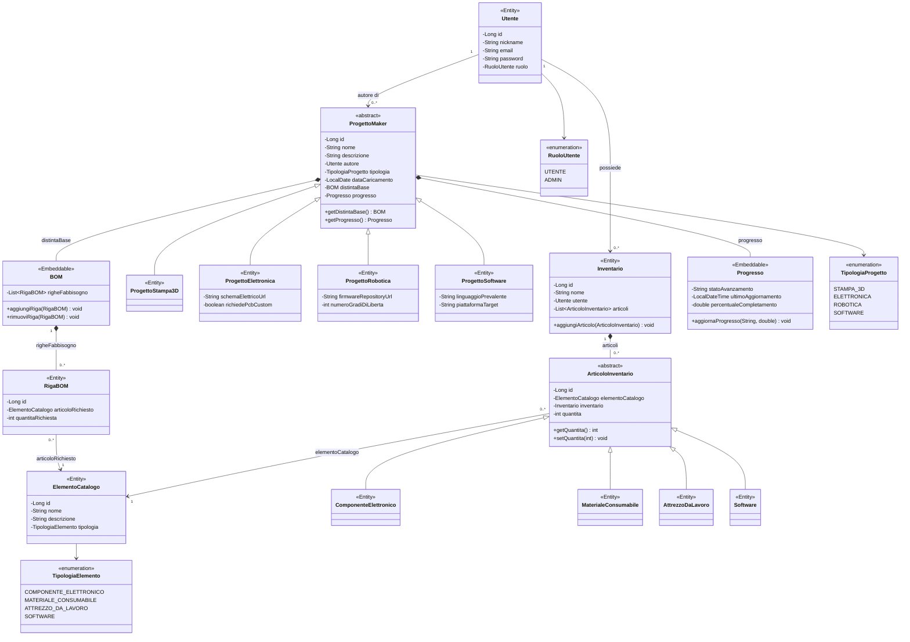
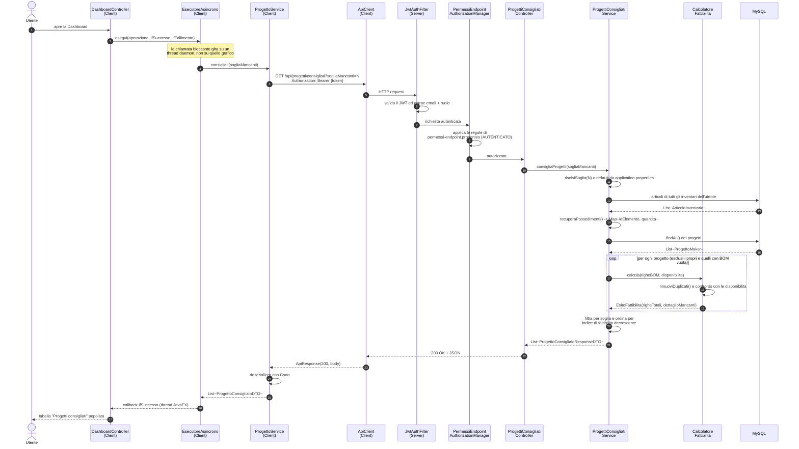

# Diagrammi di supporto per MakerManager

> [!note]
> Se non visualizzi in contenuto di questo file è perché il tuo lettore non supporta la visualizzazione delle anteprime di diagrammi mermaid. Puoi aprire questo file da VsCode installando l'estensione Markdown Mermaid Preview Support o visualizzare il file alternativo contenente le immagini: [**`diagrammi-alt.md`**](./diagrammi-alt.md) 

- [Diagrammi di supporto per MakerManager](#diagrammi-di-supporto-per-makermanager)
  - [Architettura del Client](#architettura-del-client)
  - [Architettura del Server](#architettura-del-server)
  - [Dominio del Server](#dominio-del-server)
  - [Diagramma di sequenza: Progetti Consigliati](#diagramma-di-sequenza-progetti-consigliati)

## Architettura del Client

```mermaid
classDiagram
    direction TB

    %% -------------------------- AVVIO ------------------------------------

    class App {
        <<Application>>
        -Scene scene$
        +start(Stage) void
        +setRoot(String)$ void
        +getStylesheet()$ String
    }

    class AppConfig {
        <<utility>>
        +String BASE_URL$
        +String ENDPOINT_AUTH_LOGIN$
        +String ENDPOINT_CATALOGO$
        +String ENDPOINT_INVENTARIO$
        +String ENDPOINT_PROGETTI$
        +String ENDPOINT_PROGETTI_CONSIGLIATI$
        +String ENDPOINT_INIZIALIZZA$
    }

    %% ----------------------- PRESENTAZIONE -------------------------------

    class PannelloRicaricabile {
        <<interface>>
        +ricarica() void
    }

    class ShellController {
        -Map~String, Parent~ pannelli
        -Map~String, PannelloRicaricabile~ pannelliRicaricabili
        +initialize(URL, ResourceBundle) void
        -caricaPannello(String, String) void
        -mostra(String) void
    }

    class AuthController {
        +onAccedi() void
        +onRegistrati() void
        -completaAutenticazione(RispostaAutenticazioneDTO) void
    }

    class DashboardController {
        +ricarica() void
    }
    class TuttiProgettiController {
        +ricarica() void
    }
    class InventarioController {
        +ricarica() void
        +onCreaInventario() void
        +onEliminaInventario() void
    }
    class MieiProgettiController {
        +ricarica() void
        +onCreaProgetto() void
        +onEliminaProgetto() void
    }
    class DatabaseController {
        +ricarica() void
        +onInizializza() void
        +onAggiungiElemento() void
        +onEliminaElemento() void
    }
    class ImpostazioniController {
        +onSalva() void
        +onRipristinaPredefinito() void
    }
    class ContenutoInventarioController {
        +onAggiungiArticolo() void
        +onEliminaArticolo() void
    }
    class DettaglioProgettoController {
        +onModificaBom() void
        +onAggiungiRiga() void
        +onEliminaRiga() void
    }

    PannelloRicaricabile <|.. DashboardController
    PannelloRicaricabile <|.. TuttiProgettiController
    PannelloRicaricabile <|.. InventarioController
    PannelloRicaricabile <|.. MieiProgettiController
    PannelloRicaricabile <|.. DatabaseController

    ShellController --> PannelloRicaricabile : ricarica al cambio pannello
    App --> AuthController : carica auth.fxml
    AuthController --> ShellController : dopo il login carica shell.fxml
    InventarioController --> ContenutoInventarioController : apre finestra
    MieiProgettiController --> DettaglioProgettoController : apre finestra

    %% -------------------------- SERVICE ----------------------------------

    class AuthService {
        <<utility>>
        +login(String, String)$ RispostaAutenticazioneDTO
        +registrati(String, String, String)$ RispostaAutenticazioneDTO
    }
    class CatalogoService {
        <<utility>>
        +elenco()$ List~ElementoCatalogoDTO~
        +crea(String, String, String)$ ElementoCatalogoDTO
        +elimina(long)$ void
    }
    class InventarioService {
        <<utility>>
        +elencoInventariConConteggio()$ List~InventarioDTO~
        +contenutoInventario(long)$ List~ArticoloInventarioDTO~
        +creaInventario(String)$ InventarioDTO
        +aggiornaQuantita(long, int)$ ArticoloInventarioDTO
        +eliminaArticolo(long)$ void
    }
    class ProgettoService {
        <<utility>>
        +elencoTutti()$ List~ProgettoDTO~
        +elencoDiUtente(long)$ List~ProgettoDTO~
        +dettaglio(long)$ ProgettoConBomDTO
        +crea(String, String, String)$ ProgettoDTO
        +aggiungiRigaBom(long, long, int)$ RigaBOMDTO
        +consigliati(Integer)$ List~ProgettoConsigliatoDTO~
    }
    class AmministrazioneService {
        <<utility>>
        +inizializzaDatabase()$ void
    }

    %% --------------------------- NETWORK ---------------------------------

    class ApiClient {
        <<utility>>
        -HttpClient HTTP_CLIENT$
        +get(String, String)$ ApiResponse
        +post(String, String, String)$ ApiResponse
        +patch(String, String, String)$ ApiResponse
        +delete(String, String)$ ApiResponse
        -aggiungiAutorizzazione(Builder, String)$ void
    }

    class ApiResponse {
        <<record>>
        +int statusCode
        +String body
        +isSuccesso() boolean
    }

    class ApiException {
        <<RuntimeException>>
        -int statusCode
        +da(ApiResponse)$ ApiException
        -estraiMessaggio(String)$ String
    }

    %% -------------------- SESSIONE E UTILITY -----------------------------

    class Sessione {
        <<singleton>>
        -Sessione ISTANZA$
        -String token
        -Long idUtente
        -String ruolo
        -Integer sogliaMancanti
        +getIstanza()$ Sessione
        +avvia(String, Long, String, String, String) void
        +termina() void
        +isAdmin() boolean
    }

    class EsecutoreAsincrono {
        <<utility>>
        +esegui(Operazione~T~, Consumer~T~, Consumer~Throwable~)$ void
    }

    class GsonProvider {
        <<utility>>
        +get()$ Gson
    }

    %% ---------------------------- DTO ------------------------------------

    class RispostaAutenticazioneDTO
    class UtenteDTO
    class ElementoCatalogoDTO
    class InventarioDTO
    class ArticoloInventarioDTO
    class ProgettoDTO
    class ProgettoConBomDTO
    class ProgettoConsigliatoDTO
    class RigaBOMDTO

    ProgettoConBomDTO *-- RigaBOMDTO

    %% ------------------------ COLLEGAMENTI -------------------------------

    AuthController ..> AuthService
    DashboardController ..> ProgettoService
    TuttiProgettiController ..> ProgettoService
    MieiProgettiController ..> ProgettoService
    DettaglioProgettoController ..> ProgettoService
    InventarioController ..> InventarioService
    ContenutoInventarioController ..> InventarioService
    DatabaseController ..> CatalogoService
    DatabaseController ..> AmministrazioneService
    ImpostazioniController ..> Sessione

    AuthService ..> ApiClient
    CatalogoService ..> ApiClient
    InventarioService ..> ApiClient
    ProgettoService ..> ApiClient
    AmministrazioneService ..> ApiClient

    AuthService ..> GsonProvider
    ProgettoService ..> Sessione : legge il token
    InventarioService ..> Sessione : legge il token

    ApiClient ..> ApiResponse : produce
    ApiException ..> ApiResponse : costruita da

    DashboardController ..> EsecutoreAsincrono
    InventarioController ..> EsecutoreAsincrono
    AuthService ..> ApiException : lancia

    ProgettoService ..> ProgettoConsigliatoDTO
    InventarioService ..> InventarioDTO
    CatalogoService ..> ElementoCatalogoDTO
    AuthService ..> RispostaAutenticazioneDTO
```

## Architettura del Server

## Dominio del Server

## Diagramma di sequenza: Progetti Consigliati

